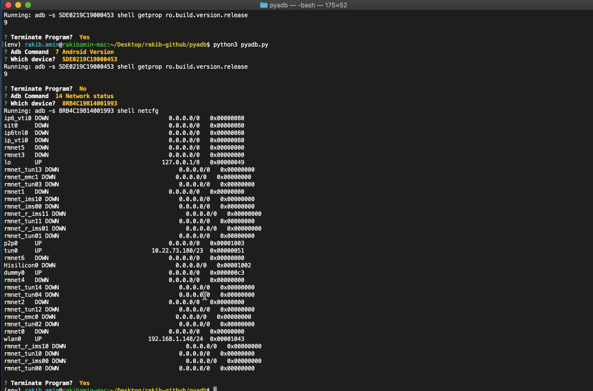

## pyadb
Tool for easy navigation using adb command line tool

### setup 
#### mac/linux
```
cd pyadb/
python -m venv env
source env/bin/activate
pip install -r r.txt
```
#### windows
```
cd pyadb/
python -m venv env
cd env/Scripts
activate
pip install -r r.txt
```
### run


### credits
http://codeadapter.blogspot.com/2014/10/adb-commands.html
